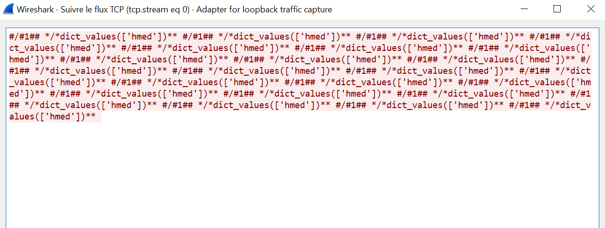

# Chat Application with GUI over TCP/IP Developed in Python using PyQt5

Hello friends,

This is a personal project I created in 2021 as a way for me to practice **PyQt5, Socket, Threading, and a little bit of networking** while completely *neglecting security*. More on that later.   

The application is composed of three main files that can be found in [**Gui Stable**](https://github.com/HmedLimam/PyQtChat/tree/master/Gui%20Stable) folder:

* **server.py:** This file should be running on the server-side. It opens a connection to a port of your choosing and then waits for and handles client connections.
* **welcome.py:** This is the only file to be run by users wanting to access the chat app. It asks the user for the host and port they're trying to connect to, as well as their name.
* **chat.py:** Once the client has entered the necessary information in welcome.py, the welcome window hides, and the chat window appears.

ℹ **welcome2.py** is used to simulate two different clients.  
ℹ The **resources** folder contains pictures and audio files used.

## Server Functionalities

* Send broadcast messages to all users at any given time.
* Send client connectivity update messages to all users.

## Client Functionalities

* See an updated list of currently connected clients.
* Ring a client of your choosing.
* Ring all clients.
* Use custom emojis.
* Send private messages.
* See a list of all available commands using `/h`.

## Some Screenshots
### Welcome.py


### Server and Client example


## Security
It goes without saying that the application **shouldn't be used in any official setting**, as its only purpose is academic research. At the time of creation, security wasn't a consideration. The security is BAD. Communication can be intercepted in plaintext, and potentially, fake packets can be crafted, leading to impersonation.  


### Proof of Concept (Black Box Penetration Testing)
#### Intercepting the unencrypted traffic with Wireshark
ℹI rerun the server and it's now running at 192.168.1.128:1337.  
  

I first noticed that there's a lot of traffic between the server and the client. Upon further investigation, it seems like the server sends the list of currently connected clients every x seconds. I tried sending a message to see how the traffic responds to that. At first, it was quite hard to catch it with all the traffic being sent, but after sorting by length in Wireshark, I was able to catch this.  


So my goal now is to try to impersonate hmed. I created this Python script to test its feasibility.  
  
```python
import socket

hackerSocket = socket.socket(socket.AF_INET, socket.SOCK_STREAM)
hackerSocket.connect(("192.168.1.128", 1337))
hackerSocket.send(b"hacker")
myAddr = hackerSocket.recv(1024).decode()
welcomeMsg = hackerSocket.recv(1024).decode()
userJoinedMsg = hackerSocket.recv(1024).decode()
listOfClients = hackerSocket.recv(1024).decode()
hackerSocket.send(b'<span style=" color: #ff0000;">hmed</span>: hey there! ')
```


But sadly, that didn't work, as the server keeps sending messages using the name that you first send as a client.  

ℹ It looks like the server has no way of checking whether a user is trying to connect with an already used name, and therefore anyone could log in using "hmed" and they will be able to impersonate them.  


✅ Impersonating users is pretty easy, it's a huge security flaw. We don't need to code anything, we just have to log in using the name of the user we want to impersonate even if they're already connected.  

**What about impersonating the server? 🤔**  
  

  
Again, I used wireshark to intercept a message sent by the server.  

  

#### Exploitation

```python
import socket

hackerSocket = socket.socket(socket.AF_INET, socket.SOCK_STREAM)
hackerSocket.connect(("192.168.1.128", 1337))
hackerSocket.send(b"hacker")
myAddr = hackerSocket.recv(1024).decode()
welcomeMsg = hackerSocket.recv(1024).decode()
userJoinedMsg = hackerSocket.recv(1024).decode()
listOfClients = hackerSocket.recv(1024).decode()
hackerSocket.send(b"<h4 style='color:#800080'>server: this is a hacker!</h4>******server****** ")
```

  


✅ We could impersonate the server as well!  

## Conclusion
In summary, while the chat application provides a learning opportunity for PyQt5 and networking concepts, its security is severely lacking. The ability to intercept and impersonate both users and the server highlights significant vulnerabilities. This underscores the importance of implementing robust security measures. Therefore, the application should only be used for educational purposes and not in any official or production environment. Future development efforts should focus on addressing these security flaws to ensure safe communication.
